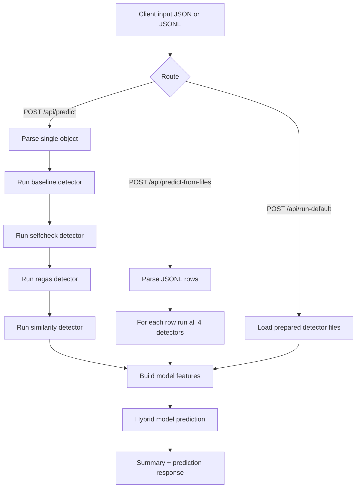

# Backend Flow

This document describes the current backend runtime flow.

## 1. Goal

For each user input (single JSON object or JSONL file), backend does this in order:

1. Compute all detector outputs using the existing detector logic from this codebase.
2. Convert detector outputs to the hybrid model feature format.
3. Run the hybrid model.
4. Return hallucination prediction plus detector diagnostics.

No id-based lookup cache of historical detector result files is used for `/api/predict` and `/api/predict-from-files`.

## 2. Runtime Components

- backend/app.py
  - HTTP routing and response construction.
- backend/raw_detector_pipeline.py
  - Parses raw input and calls live detector execution.
- backend/live_detectors.py
  - Implements detector logic ported from existing notebooks.
- backend/model_service.py
  - Loads and runs hybrid model.
- backend/config.py
  - Paths, thresholds, and workspace discovery.

## 3. Detector Logic Sources

The live detector code follows notebook logic already present in this repo:

- Baseline detector logic:
  - notebooks/files-distributed-based-on-difficulty/main.ipynb
- SelfCheck detector logic:
  - notebooks/files-distributed-based-on-difficulty/selfcheckrag.ipynb
- RAGAS detector logic:
  - notebooks/files-distributed-based-on-difficulty/ragas.ipynb
- Similarity detector logic:
  - notebooks/files-distributed-based-on-difficulty/similarity_detector.ipynb

## 4. Startup Flow

1. Flask starts in backend/app.py.
2. CORS is enabled.
3. HybridModelService initializes once and loads:
   - notebooks/final_all_dataset/hybrid_detector_model.pkl
4. Detector helper objects in backend/live_detectors.py are lazily initialized and cached:
   - Ollama judge/sampler models
   - embedding model
   - RAGAS helper components

If model file is missing, startup fails fast.

## 5. Per-Request Flow (Single JSON)

Route: POST /api/predict

Input:
- raw object containing at least meaningful fields for detector evaluation, typically:
  - id
  - question
  - evidence
  - rag_answer

Processing:
1. Parse JSON body.
2. Compute baseline detector score (LLM judge prompt vs evidence and rag_answer).
3. Compute selfcheck detector score:
   - generate N stochastic samples
   - judge target answer consistency against samples
4. Compute RAGAS faithfulness score for that row.
5. Compute retrieval similarity (embedding cosine similarity).
6. Convert raw detector outputs to model features:
   - baseline: 0/1
   - selfcheck: 0/1
   - ragas: 1 if faithfulness < 0.7 else 0
   - similarity: 1 if similarity_score < 0.75 else 0
7. Run hybrid model prediction.
8. Return prediction + probabilities + detector debug payload.

## 6. Per-Request Flow (JSONL)

Route: POST /api/predict-from-files

Input:
- multipart form-data
- input_file: JSONL (one object per line)

Processing:
1. Parse JSONL stream.
2. For each row, run full detector computation pipeline (same as single JSON route).
3. Batch the computed feature rows into model_service.predict_records.
4. Merge detector debug data and metadata.
5. Return:
   - summary (total, hallucinated, not_hallucinated, optional accuracy)
   - predictions list

## 7. Default Prepared-File Flow

Route: POST /api/run-default

Purpose:
- Uses prepared detector outputs from notebooks/final_all_dataset/150_filtered.

Processing:
1. Validate default detector files exist.
2. Build merged records via backend/detector_pipeline.py.
3. Run hybrid model.
4. Return summary + predictions.

This route is precomputed-file mode; other two routes are live-computation mode.

## 8. Model Feature Contract

Hybrid model input columns must exist in this exact order:

1. baseline
2. ragas
3. selfcheck
4. similarity

If any is missing, prediction fails.

## 9. Key Threshold Rules

- RAGAS binarization:
  - ragas = 1 if faithfulness < 0.7 else 0
- Similarity binarization:
  - similarity = 1 if score < 0.75 else 0

## 10. Error Handling

Common failures:

- Missing/invalid JSON or JSONL.
- Empty rag_answer for detector steps.
- Ollama model unavailable.
- Missing detector dependencies.
- RAGAS runtime errors.

API returns 400 with error details for detector pipeline failures.

## 11. Sequence Diagram

## 12. Operational Notes

- Live detector routes are slower than lookup mode because they compute each detector every request.
- Make sure Ollama is running and model qwen2.5:7b is available.
- Backend is API-only, so GET / returns 404 by design.
